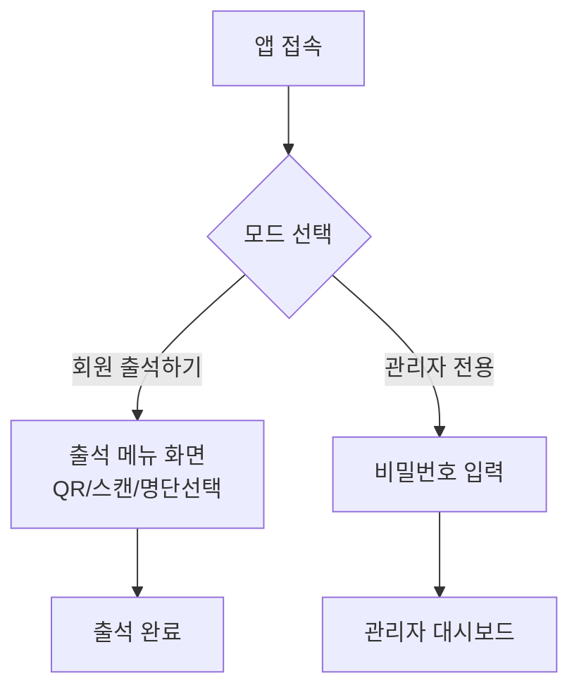
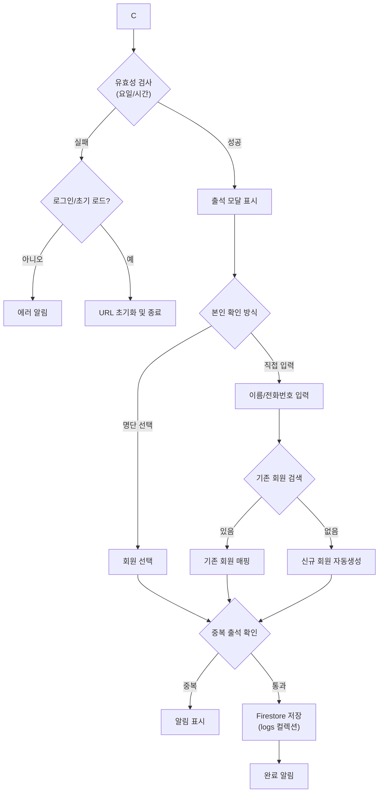
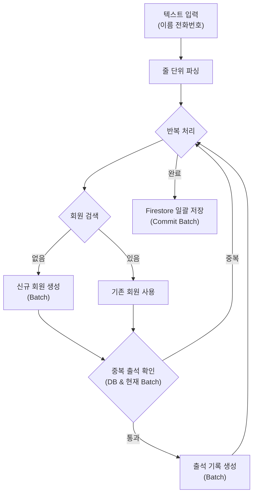

# 📋 몸펴기생활운동 연신내 출석부

> **📢 마이그레이션 공지:**  
> 현재 보시는 프로젝트는 **Vanilla JS (v1)** 버전입니다.  
> 더 나은 기능과 유지보수를 위해 **React (v2)** 버전으로 새롭게 개발될 예정입니다.  
> 상세 계획은 [MIGRATION.md](./MIGRATION.md)에서 확인하실 수 있습니다.
> - **간략 계획:** [MIGRATION.md](./MIGRATION.md)
> - **상세 개발 계획서:** [REACT 개발계획.MD](./REACT 개발계획.MD)

별도의 서버 구축 없이 웹 브라우저만으로 동작하는 **QR 코드 기반 출석 체크 및 관리 시스템**입니다.  
소규모 학원, 스터디 그룹, 동호회 등에서 간편하게 출석을 관리하고 통계를 확인할 수 있도록 설계되었습니다.

---

## 🆕 최신 변경사항 (Latest Updates)
- **반응형 디자인 개선:** 다양한 모바일 기기(작은 폰, 폴더블폰 등)에서 화면이 깨지거나 잘리는 현상을 해결했습니다. 모든 페이지와 팝업창이 화면 크기에 맞게 자동으로 조절됩니다.
- **인증 시스템 개선 (3단계):** 비밀번호 변경 및 회원 삭제/데이터 초기화 시의 보안 확인 로직을 새로운 Firebase 인증 시스템에 맞게 안전하게 변경했습니다.
- **인증 시스템 개선 (2단계):** 관리자 로그인을 이메일/비밀번호 기반의 Firebase Authentication으로 전환했습니다. 이제 여러 기기에서 동일한 계정으로 로그인할 수 있습니다.
- **인증 시스템 개선 준비:** 여러 기기에서 비밀번호가 동기화되지 않는 문제를 해결하기 위해, Firebase Authentication 시스템을 도입하기 위한 기반 작업을 완료했습니다. (1단계)
- **리포트 구조 개선:** '월간 총 출석' 및 '출석 추이 그래프'를 '대시보드' 탭으로 분리하고, 가장 첫 번째 탭으로 배치하여 가독성과 사용성을 높였습니다.
- **UI 텍스트 개선:** 회원 출석 화면의 담당 사범 표시에 '사범' 칭호를 추가하여 명확성을 높였습니다.
- **담당 사범 관리 기능 추가:** 관리자 홈 화면에서 각 수업(차수)별 담당 사범을 등록, 수정, 삭제할 수 있는 기능을 추가했습니다.
- **출석 화면 사범 정보 표시:** 회원 출석 화면의 '현재 수업' 정보에 담당 사범 이름이 함께 표시되도록 개선했습니다.
- **개발자 도구 추가:** 로그인 화면에 특정 월의 테스트 출석 데이터를 대량으로 생성하는 임시 기능을 추가했습니다.
- **리포트 상호작용 추가:** '신규 회원' 리포트의 그래프 막대를 클릭하면 해당 월에 가입한 회원 명단과 가입일을 팝업으로 볼 수 있는 기능을 추가했습니다.
- **리포트 설명 보강:** '신규 회원' 리포트에 시스템 도입 초기 데이터에 대한 안내 문구를 추가하여, 데이터 오해 소지를 줄였습니다.
- **리포트 용어 변경:** '수업 인기도 분석'이라는 민감할 수 있는 명칭을 '수업 참여 현황'으로 변경하여 중립성을 높였습니다.
- **리포트 UI 가독성 향상:** 월 선택 입력창의 글자 크기를 추가로 확대하여 시인성을 개선했습니다.
- **리포트 UI 접근성 개선:** '리포트 및 통계' 페이지의 월 선택 입력창 글자 크기를 키워 가독성을 높였습니다.
- **리포트 UI 추가 개선:** '개인별 주간 출석' 리포트의 이름 표시를 한 줄로 최적화하고, 탭 스크롤 화살표가 초기 로딩 시에도 정상적으로 표시되도록 수정했습니다.
- **리포트 모바일 UI 개선:** 모바일 환경에서 리포트 탭이 화면을 벗어날 경우 스크롤이 가능하다는 것을 알려주는 화살표를 추가하고, '차수별 주간 출석' 리포트의 디자인을 더 간결하게 변경하여 가독성을 높였습니다.
- **리포트 가독성 개선:** '차수별 주간 출석' 리포트의 수업(차수) 표시 방식을 2줄로 변경하여 가독성을 높였습니다.
- **회원 출석 편의성 개선:** 회원 출석 화면에서 검색 결과가 없을 경우, 해당 이름으로 즉시 신규 회원을 등록하고 출석 처리할 수 있는 기능을 복구했습니다.
- **리포트 기능 버그 수정:** 새롭게 추가된 3종의 리포트가 보이지 않던 문제를 해결하고, 탭 UI가 정상적으로 작동하도록 수정했습니다.
- **리포트 기능 대폭 강화:** '월별 신규 회원', '장기 미출석 회원', '수업별 인기도' 분석 리포트 3종을 추가하고, 가독성 높은 탭 인터페이스를 도입하여 UI를 개선했습니다.
- **모바일 UI 최적화:** 회원 출석 화면에서 날짜/수업 선택 영역이 모바일 화면에 잘 맞도록 반응형으로 크기를 조정했습니다.
- **환영 메시지 크기 조정:** 회원 출석 화면의 환영 메시지가 너무 크다는 피드백을 반영하여, 크기를 줄여 명단 입력에 부담이 없도록 조정했습니다.
- **환영 메시지 변경:** 회원 출석 화면의 환영 메시지를 '몸펴기생활운동'의 구호("허리는 세우고, 가슴은 펴고, 고개는 들자!")에 맞게 변경하여 앱의 정체성을 강화했습니다.
- **'출석 취소' 알림 UI 개선:** 출석 완료 및 취소 시 나타나는 알림창의 레이아웃을 2줄(메시지, 버튼)로 변경하여 가독성을 높였습니다.
- **실행 취소 UI 개선:** '실행 취소' 팝업의 크기를 키우고, 버튼 명칭을 '출석 취소'로 변경하여 어르신들이 더 쉽게 인지하고 사용할 수 있도록 개선했습니다.
- **실행 취소(Undo) 기능 추가:** 실수로 출석을 잘못 처리했을 경우를 대비해, 출석 완료 후 5초간 나타나는 '실행 취소' 버튼을 추가했습니다. 이 버튼을 누르면 해당 출석 기록이 즉시 삭제됩니다.
- **고령자 친화적 UI 개선:** 어르신들의 사용 편의성을 높이기 위해 앱 전반의 폰트 크기를 키우고, 모든 버튼과 입력창의 크기를 확대했습니다. 또한, 눈의 피로를 줄이기 위해 화면을 고대비(High Contrast) 스타일로 변경했습니다.
- **회원 출석 동기화 기능 최종 해결:** 초기 로딩 및 동기화 버튼 클릭 시 날짜와 수업이 갱신되지 않던 근본적인 원인(Race Condition)을 해결했습니다. 이제 초기 진입과 버튼 클릭 모두에서 현재 날짜와 수업이 완벽하게 자동 선택됩니다.
- **동기화 시각 효과 강화:** 동기화 버튼 클릭 시 수업 정보 텍스트가 부드럽게 커지며 반짝이는 애니메이션을 추가하여, 정보 갱신 여부를 사용자가 더 직관적으로 인지할 수 있도록 개선했습니다.
- **회원 출석 동기화 기능 완벽 복구:** 동기화 버튼 클릭 시 날짜와 수업 목록이 즉시 갱신되지 않던 타이밍 이슈를 해결했습니다. 이제 버튼 클릭 시 아이콘이 회전하며 현재 시간에 맞는 수업을 정확하게 찾아 선택합니다.
- **회원 출석 모드 동기화 버그 최종 수정:** 전역 스코프 문제로 인해 회원 출석 화면에서 날짜와 수업 정보가 공백으로 남던 현상을 해결하기 위해 주요 상수와 헬퍼 함수를 전역(`window`) 객체로 전환하여 안정성을 확보했습니다.
- **사용자 접근성 개선 (고령자 배려):** 회원 출석 화면의 '출석 종료' 버튼 크기를 대폭 확대하고 디자인을 개선하여, 60세 이상 어르신들도 쉽게 인지하고 누를 수 있도록 수정했습니다.
- **회원 출석 화면 치명적 버그 수정:** 페이지 전환 시 발생하던 자바스크립트 에러를 해결하여 시스템 날짜와 수업 정보가 공백으로 나오던 현상을 완벽히 수정했습니다. 이제 회원 출석 화면 진입 시 오늘 날짜와 현재 수업이 즉시 표시됩니다.
- **회원 출석 모드 날짜/수업 공백 문제 최종 해결:** 시스템 날짜를 날짜 입력 필드에 강제로 주입하고, "찾는 중" 메시지가 고착되지 않도록 초기화 로직을 전면 수정했습니다. 요소 로드 시점과 상관없이 재시도 로직을 통해 무조건 값이 채워지도록 안정성을 극대화했습니다.
- **회원 출석 모드 초기화 버그 및 UI 통일:** 회원 출석 화면 진입 시 날짜/수업이 공백으로 남거나 "찾는 중" 메시지가 사라지지 않던 문제를 재시도 로직(Retry Mechanism)을 통해 완벽히 해결했습니다. 또한, 동기화 버튼 아이콘을 `fas fa-sync-alt`로 통일하여 UI 일관성을 높였습니다.
- **회원 출석 모드 동기화 로직 전면 재구축:** 회원 출석 화면 진입 시 날짜와 수업(차수)이 공백으로 나오던 문제를 해결하기 위해 초기화 로직을 단일화하고, DOM 안정성을 고려한 지연 실행 및 강제 주입 방식을 적용하여 기능을 완벽히 복구했습니다.
- **날짜 및 수업 자동 선택 로직 완전 해결:** 회원 출석 화면 진입 시 발생하던 날짜/수업 공백 문제를 해결하기 위해 날짜 생성 방식을 표준화하고, DOM 렌더링 지연 시간을 조정하여 초기화 순서를 엄격하게 보장하도록 수정했습니다.
- **회원 출석 모드 자동 선택 로직 최종 수정:** 회원 출석 화면 진입 시 날짜와 수업(차수)이 공백으로 나오던 현상을 해결하기 위해 초기화 로직에 미세 지연(setTimeout)을 추가하고, 날짜 생성 및 요일 계산 방식을 더욱 견고하게 개선했습니다.
- **회원 출석 모드 초기화 및 동기화 버그 수정:** 엄격 모드에서의 변수 선언 오류를 수정하여 스크립트 중단 문제를 해결하고, 회원 출석 화면 진입 시 날짜와 수업(차수)이 공백으로 나오던 현상 및 동기화 버튼 작동 불량 문제를 완벽히 수정했습니다.
- **날짜 및 수업 자동 선택 버그 수정:** 일부 환경에서 날짜와 수업(차수)이 공백으로 표시되던 문제를 해결하기 위해 현지 시간 기준의 날짜 생성 로직과 요일 계산 방식을 강화했습니다.
- **현재 시간 동기화 기능 추가:** 수업 목록 옆에 '현재 시간 확인(동기화)' 버튼을 추가하여, 자동 선택이 어긋나거나 시간이 지났을 때 즉시 현재 수업으로 맞출 수 있도록 개선했습니다.
- **자동 선택 로직 보완 및 관리자 UI 개선:** 현지 시간 기준 날짜/수업 자동 선택 로직을 강화하고, 관리자 헤더의 버튼 순서 조정 및 '뒤로가기' 버튼을 더 크고 직관적으로 개선했습니다.
- **데이터 초기화 보안 UI 강화:** 브라우저 기본 `prompt` 대신, 강렬한 경고 디자인과 애니메이션이 적용된 커스텀 모달을 도입하여 데이터 삭제 전 최종 확인 절차의 시인성을 극대화했습니다.
- **관리자 UI 개선:** '초기화' 버튼의 색상을 경고 의미를 담은 빨간색으로 변경하여 오클릭 방지 및 시각적 경고를 강화했습니다.
- **자동 선택 로직 및 관리자 UI 개선:** 앱 실행 및 종이 명부 입력 시 현재 수업(차수)이 정확히 자동 선택되도록 로직을 보완하고, 관리자 헤더의 버튼 순서 변경 및 '뒤로가기' 버튼 크기를 확대했습니다.
- **UI 일관성 및 자동화 개선:** 종이 명부 입력과 회원 출석 모드에서 현재 날짜와 수업(차수)이 자동으로 선택되도록 개선하고, 용어를 '수업(차수)'으로 통일했습니다.
- **현대적인 UI 스킬 적용:** 메쉬 그라데이션 배경, 글래스모피즘(유리 질감) 카드, 벤토 그리드 레이아웃 및 부드러운 애니메이션을 적용하여 UI 디자인을 대폭 개선했습니다.
- **HTML 시맨틱 태그 및 웹 접근성 개선:** `main`, `section`, `nav` 등 시맨틱 태그를 적용하고, 아이콘에 `aria-hidden`을 추가하여 웹 표준 및 접근성을 강화했습니다.
- **친숙한 용어로 변경:** '모드'라는 생소한 용어 대신 '회원 출석하기', '관리자 전용' 등 더 직관적이고 친숙한 용어로 UI를 개선했습니다.
- **용어 표준화:** 초기 화면의 '패스워드'를 '비밀번호'로 통일하여 사용자 혼란을 방지하고 UI 일관성을 강화했습니다.
- **회원 출석 모드 개선:** 회원 출석 완료 후 초기 화면으로 나가지 않고 화면을 유지하여 연속적인 출석이 가능하도록 수정했습니다.
- **관리자 모드 편의성 개선:** 관리자 화면 상단 헤더에 초기 화면(모드 선택)으로 돌아갈 수 있는 '뒤로가기' 버튼을 추가했습니다.
- **버그 수정:** 비밀번호 변경 창에서 '마스터 복구 코드'가 표시되지 않던 문제를 해결했습니다.
- **초기 화면 복구:** 앱 실행 시 자동으로 관리자 모드에 진입하던 기능을 제거하고, 항상 모드 선택(회원용/관리자용) 화면이 먼저 나오도록 원상복구했습니다.
- **아이콘 보안 강화:** 외부 HTTP 링크 대신 로컬 이미지 경로를 사용하여 HTTPS 환경에서도 아이콘이 정상적으로 보이도록 수정했습니다.
- **앱 아이콘 변경:** '몸펴기생활운동' 공식 홈페이지의 '하체풀기' 아이콘을 앱 아이콘으로 적용했습니다.
- **비밀번호 복구 시스템 도입:** 비밀번호 분실 시 관리자 권한을 되찾을 수 있는 '마스터 복구 코드' 기능을 추가했습니다. (비밀번호 변경 메뉴에서 확인 가능)
- **비밀번호 관리 버그 수정:** 비밀번호 변경 후에도 초기 비밀번호가 유지되던 로직 오류를 수정하고, 모든 비밀번호 비교 시 공백을 제거하도록 강화했습니다.
- **회원 출석 모드 개선:** 회원 출석 화면에서 날짜와 차수를 직접 선택할 수 있는 기능을 추가하고, 이름 클릭 시 즉시 출석이 가능하도록 수정했습니다.
- **그래프 버그 수정:** 월간 총 출석 그래프 상단에서 숫자가 잘려 보이지 않던 현상을 여백 조정을 통해 해결했습니다.
- **아이콘 설정 구조화:** 사용자가 추후 아이콘을 쉽게 변경할 수 있도록 `index.html` 상단에 아이콘 설정 섹션을 명확히 구분했습니다.
- **아이콘 추가:** 앱의 정체성을 나타내는 앱 아이콘(파비콘) 및 모바일 홈 화면 아이콘을 추가했습니다.
- **출석 체크 기능 강화:** 출석 체크 시 날짜와 차수를 직접 변경할 수 있는 기능을 추가했습니다. (기본값은 오늘 날짜와 현재 시간대 수업으로 자동 설정됩니다.)
- **그래프 가독성 개선:** 월간 총 출석 그래프의 각 꼭지점에 출석 인원수가 상시 표시되도록 개선했습니다.
- **중복 회원 등록 방지:** 회원 등록 시 이름과 전화번호 뒷자리가 모두 동일한 경우 중복 등록되지 않도록 보안 로직을 강화했습니다.
- **명단 입력 알림 개선:** 종이 명부 일괄 입력 완료 시, 등록된 일자, 차수, 성함 목록을 팝업으로 상세히 표시하도록 개선했습니다.
- **보안 강화:** 초기 비밀번호를 `0000`에서 `1234`로 변경했습니다.
- **보안 강화:** 초기 비밀번호를 `0000`에서 `1234`로 변경하여 보안성을 높였습니다.
- **로그인 편의성 개선:** 관리자 로그인 화면에 비밀번호를 확인할 수 있는 '비밀번호 표시' 기능을 추가했습니다.
- **관리자 로그인 버그 수정:** QR 코드 세션 정보가 URL에 남아있을 때 관리자 로그인이 튕기는 현상(리다이렉트 루프)을 해결했습니다.
- **관리자 보안 복구:** 관리자 모드 진입 시 비밀번호 입력 절차를 다시 활성화하여 보안을 강화했습니다.
- **보안 강화 (무차별 대입 방지):** 민감한 작업 시 비밀번호를 5회 연속 틀릴 경우, 보안을 위해 1분간 재시도를 제한하는 기능을 추가했습니다.
- **보안 UI 개선:** 데이터 초기화 및 회원 삭제 시 나타나던 브라우저 기본 `prompt` 창을 앱 내 커스텀 비밀번호 확인 모달로 교체하여 UX를 개선했습니다.
- **보안 범위 확대:** '데이터 초기화' 외에도 '회원 삭제' 시 관리자 비밀번호를 확인하도록 보안 로직을 추가 적용했습니다.
- **민감 기능 보안 강화:** 관리자 모드 진입은 비밀번호 없이 가능하지만, '데이터 초기화'와 같은 민감한 기능을 실행할 때만 관리자 비밀번호를 다시 확인하도록 보안을 강화했습니다.
- **관리자 로그인 제거:** 관리자 모드 진입 시 비밀번호 입력 없이 즉시 접속 가능하도록 변경했습니다.
- **관리자 로그인 수정:** 초기 비밀번호를 `0000`으로 변경하고 로그인 로직을 안정화했습니다.
- **관리자 보안 강화:** 관리자 모드 진입 시 비밀번호 입력 절차를 다시 활성화하여 보안성을 높였습니다.
- **관리자 로그인 간소화:** 관리자 모드 진입 시 비밀번호 입력 절차를 제거하여 즉시 접속 가능하도록 수정했습니다.
- **명단 선택 및 초성 검색 기능:** 회원 명단에서 이름을 직접 찾거나, 초성(예: 'ㄱㄷㅎ')만 입력하여 빠르게 회원을 선택할 수 있는 기능을 추가했습니다.
- **운영 모드 분리 (관리자/회원):** 암호가 필요한 '관리자 모드'와 암호 없이 출석 기능만 사용하는 '회원 출석 모드'를 분리했습니다.
- **관리자 로그인 오류 수정:** 특정 상황에서 비밀번호 "1234"가 인식되지 않던 로직을 수정하고 초기화 프로세스를 강화했습니다.
- **로그인 버그 수정 및 초기 비밀번호 설정:** 관리자 로그인 시 비밀번호 인식 오류를 해결하고, 초기 비밀번호를 `1234`로 강제 설정했습니다.
- **안내 문구 통일:** 수업 시간이 아닐 때의 메시지를 "현재 진행 중인 수업이 없습니다."로 통일하여 가독성을 높였습니다.
- **로그인 안정성 및 문구 수정:** 관리자 로그인 시 비밀번호 인식 오류를 수정하고, 수업 부재 시 안내 문구를 "현재 진행 중인 수업이 없습니다"로 개선했습니다.
- **초기 비밀번호 설정:** 관리자 모드의 초기 비밀번호를 `1234`로 고정하고 로그인 UX를 개선했습니다.
- **로그인 버그 수정:** 앱 실행 시 "비밀번호가 틀렸습니다" 팝업이 뜨던 오류를 수정하고 관리자 로그인 안정성을 높였습니다.
- **회원 모드 UI 간소화:** 회원 출석 화면에서 불필요한 QR 보기 버튼을 제거하고 명단 선택 기능을 강화했습니다.
- **로그인 및 초기 화면 버그 수정:** 초기 화면의 모드 선택 버튼이 작동하지 않던 스크립트 오류를 수정하고, 관리자 로그인 로직을 안정화했습니다.
- **모바일 및 태블릿 최적화:** 태블릿의 넓은 화면을 활용할 수 있도록 그리드 레이아웃을 개선하고, 터치 조작이 용이하도록 UI 요소를 조정했습니다.
- **태블릿 최적화 UI:** 태블릿 환경에서 큰 버튼으로 쉽게 명단을 선택할 수 있도록 그리드 레이아웃을 적용했습니다.
- **Firebase Firestore 연동:** 기존 브라우저 로컬 저장소(`localStorage`) 방식에서 구글 파이어베이스(Firebase) DB로 마이그레이션했습니다.
- **실시간 동기화:** 이제 여러 기기(PC, 태블릿, 스마트폰)에서 동시에 접속해도 데이터가 실시간으로 공유됩니다.
- **데이터 안전성:** 브라우저 캐시를 삭제해도 데이터가 클라우드에 안전하게 보존됩니다.
- **QR 스캔 시 직접 입력:** 회원 목록에 없는 경우, 즉시 이름을 입력하여 출석체크(자동 회원가입)할 수 있는 기능을 추가했습니다.
- **접근성 개선 (UI):** 어르신들도 쉽게 이용할 수 있도록 입력창, 버튼, 글자 크기를 대폭 확대했습니다.
- **데이터 초기화 보안 강화:** 실수로 데이터를 삭제하지 않도록, 초기화 시 "초기화"라는 문구를 직접 입력해야만 삭제되도록 안전장치를 추가했습니다.
- **수동 입력 개선:** 명단에 이미 있는 회원도 '직접 입력'을 통해 출석할 수 있도록 기능을 개선했습니다.
- **출석 UX 개선:** 회원이 많아도 쉽게 출석할 수 있도록, QR 스캔 시 명단 선택 대신 이름 직접 입력을 기본 방식으로 변경했습니다.
- **문서 보강:** 프로젝트의 주요 로직을 쉽게 이해할 수 있도록 프로세스 흐름도(Mermaid)를 추가했습니다.
- **청각적 피드백 추가:** 출석 완료 시 '딩동' 효과음을 재생하여, 사용자가 출석이 정상 처리되었음을 소리로도 인지할 수 있도록 개선했습니다.
- **관리자 페이지 보안:** 비밀번호를 입력해야만 앱의 모든 기능에 접근할 수 있도록 로그인 기능을 추가했습니다.
- **비밀번호 변경 기능:** 관리자가 로그인 비밀번호를 직접 변경할 수 있는 기능을 추가하여 보안성을 높였습니다. (기본값: 1234)
- **버그 수정:** 페이지 로딩 시 초기화 로직이 실행되지 않아 로그인 화면이나 앱 화면이 제대로 표시되지 않던 문제를 해결했습니다.
- **명칭 변경:** 앱의 이름을 '스마트 출석부'에서 '몸펴기생활운동 연신내 출석부'로 변경했습니다.

- **버그 수정:** 관리자 도구의 버튼 클릭 시 다른 모달이 뜨는 HTML 구조 오류를 수정했습니다.
- **중복 출석 방지:** 종이 명부 일괄 입력 시 동일인이 중복으로 출석 처리되는 문제를 해결했습니다.
- **리포트 개선:** '주차/차수별 현황'을 제거하고, '차수별 주간 출석' 통계를 추가하여 분석 기능을 강화했습니다.
- **리포트 정렬 개선:** '차수별 주간 출석' 리포트의 정렬 순서를 요일 및 시간순(월-오전, 월-오후...)으로 고정하여 가독성을 높였습니다.
- **리포트 기능 개선:** 리포트 순서를 '차수별 > 개인별 > 회원별'로 변경하고, '차수별 주간 출석'에서 출석 횟수 숫자를 클릭하면 해당 주차의 참석자 명단을 볼 수 있도록 UX를 개선했습니다.
 - **로그인 UX 개선:** 관리자 로그인 또는 페이지 초기 로딩 시, 유효하지 않은 QR 세션 정보로 인한 경고창(예: "오늘은 일요일입니다")이 나타나지 않도록 로직을 수정했습니다.
 - **QR 출석 편의성 개선:** 회원이 QR 코드로 접속할 경우, 관리자 비밀번호 입력 없이 즉시 출석 체크 화면으로 이동하도록 개선했습니다.
---

## 📑 PRD (제품 요구사항 정의서)

### 1. 프로젝트 개요
- **제품명:** 몸펴기생활운동 연신내 출석부
- **목표:** 서버나 DB 없이 로컬 환경(브라우저)에서 즉시 사용 가능한 경량화된 출석 관리 도구 제공.
- **타겟 사용자:** 출석 관리가 필요한 소규모 그룹의 관리자 및 회원.

### 2. 핵심 기능 명세 (Functional Requirements)

#### A. 출석 체크 (Attendance)
- **QR 코드 스캔:** 
  - 수업(세션)별 고유 QR 코드를 생성하여 회원이 스마트폰으로 스캔.
  - URL 파라미터(`?session=CODE`)를 통해 수업 정보를 인식.
- **유효성 검사:** 
  - **요일 검사:** 해당 수업의 요일과 실제 접속 요일이 일치하는지 확인.
  - **시간 검사:** 수업 시작/종료 시간 내에만 출석 가능.
- **본인 확인:** 스캔 후 드롭다운 목록에서 본인 이름을 선택하거나, **목록에 없는 경우 직접 이름을 입력하여 출석(신규 등록)**.
- **중복 방지:** 동일한 날짜, 동일 수업에 대해 중복 출석 불가 처리.

#### B. 관리자 도구 (Admin Tools)
- **QR 코드 관리:** 
  - 요일/시간대별 수업 목록에 대한 QR 코드 자동 생성.
  - 강의실 부착용 인쇄 모달 제공 (A4 출력 최적화).
- **종이 명부 입력 (Bulk Input):** 
  - 수기로 작성된 명단을 텍스트로 붙여넣기하여 일괄 출석 처리.
  - 형식: `이름` 또는 `이름 전화번호뒷자리` (예: `김철수 1234`).
  - **자동 회원가입:** 명단에 없는 이름 입력 시 자동으로 신규 회원으로 등록.

#### C. 회원 관리 (Member Management)
- **회원 등록:** 이름과 전화번호 뒷자리(선택)로 간편 등록.
- **회원 목록:** 전체 회원 조회 및 삭제 기능.
  - *보호 로직:* 출석 이력이 존재하는 회원은 실수로 삭제되지 않도록 차단.
- **상세 이력:** 회원 이름 클릭 시 개인별 전체 출석 이력(날짜, 수업명, 시간) 조회.

#### D. 리포트 및 통계 (Analytics)
- **월별 필터:** `YYYY-MM` 형식으로 데이터 필터링.
- **탭 기반 리포트:**
  - **대시보드:** 월간 총 출석 인원(UV) 및 최근 6개월 출석 추이 그래프를 제공하는 요약 탭.
  - **차수별 주간 출석:** 각 수업(차수)의 주차별 출석 횟수 통계.
  - **개인별 주간 출석:** 개인별 1~5주차 출석 현황 매트릭스.
  - **출석 순위:** 회원별 출석 횟수 랭킹.
  - **수업 참여 현황:** 월별 참여 인원이 많은 수업 순위.
  - **신규 회원:** 최근 6개월간 월별 신규 가입자 수 추이.
  - **장기 미출석:** 설정 기간 동안 활동이 없는 회원 목록.
### E. 보안 및 복구 (Security)
- **비밀번호 보호:** 관리자 모드 및 민감한 작업 시 비밀번호 확인.
- **마스터 복구 코드:** 
  - 비밀번호 분실 시를 대비한 고유 복구 코드(`RECOVERY-XXXX`) 제공.
  - 비밀번호 변경 메뉴 하단에서 확인 가능.
  - 분실 시 로그인 화면에서 코드를 입력하여 비밀번호를 `1234`로 초기화 가능.

### F. 모바일 아이콘 적용 방법 (Mobile Icon Setup)
아이콘 변경 후 모바일에서 즉시 반영되지 않는 경우 다음을 수행하세요:
1. **파일 확인:** `app-icon.png` 파일이 서버의 `index.html`과 동일한 경로에 있는지 확인.
2. **캐시 삭제:** 브라우저 설정에서 캐시된 이미지 및 데이터를 삭제.
3. **홈 화면 재등록:** 기존 홈 화면 바로가기를 삭제하고, 브라우저의 '홈 화면에 추가' 기능을 통해 다시 등록.

### 3. 데이터 관리 (Data Persistence)
- **저장소:** **Google Firebase Firestore** (NoSQL Cloud DB).
- **구조:**
  - `members` 컬렉션: 회원 정보 문서.
  - `logs` 컬렉션: 출석 기록 문서.
- **초기화:** 관리자 헤더의 '초기화' 버튼을 통해 DB 내 모든 데이터를 영구 삭제할 수 있습니다.

---

## 🔄 프로세스 흐름도 (Process Flows)

### 0. 앱 시작 및 인증 로직


### 1. QR 출석 체크 로직


### 2. 종이 명부 일괄 처리 로직


---

## 🛠 기술 스택 (Tech Stack)

| 구분 | 기술 | 비고 |
|---|---|---|
| **Core** | HTML5, JavaScript (ES6+) | Vanilla JS 구현 |
| **Backend** | **Firebase** | Firestore (DB), Realtime Sync |
| **Styling** | Tailwind CSS | CDN 방식 사용 |
| **Visualization** | Chart.js | 데이터 시각화 (그래프) |
| **Utility** | QRCode.js | QR 코드 생성 |
| **Icons** | FontAwesome | UI 아이콘 |

---

## 🚀 설치 및 실행 방법

이 프로젝트는 정적 웹페이지로 구성되어 있어 별도의 설치 과정이 필요 없습니다.

1. **파일 실행:** `index.html` 파일을 다운로드하여 크롬, 사파리 등 최신 브라우저에서 엽니다.
2. **배포 (선택 사항):** 
   - GitHub Pages, Vercel, Netlify 등을 통해 무료로 호스팅하여 팀원들과 공유할 수 있습니다.
   - **설정:** `index.html` 내부의 `firebaseConfig` 값을 본인의 프로젝트 설정으로 변경해야 합니다.

---

## 📂 파일 구조

```text
attend_v5/
├── index.html      # 메인 애플리케이션 (모든 로직 포함)
└── README.md       # 프로젝트 설명서
```

---

## ⚠️ 주의 사항

1. **QR 코드:** 웹사이트 주소가 변경되면 QR 코드를 다시 인쇄해야 합니다.
2. **보안:** 소스 코드에 Firebase API Key가 포함되므로, 공개된 저장소(Public Repo)에 업로드 시 Firebase Console에서 도메인 제한 및 보안 규칙(Security Rules)을 설정하는 것이 좋습니다.

---

## 📝 라이선스

MIT License
```

<!--
[PROMPT_SUGGESTION]README에 작성된 기능 중 '데이터 백업/복구(JSON 파일 내보내기/가져오기)' 기능을 index.html에 추가해 주세요.[/PROMPT_SUGGESTION]
[PROMPT_SUGGESTION]현재 코드를 기반으로 Vercel에 배포하기 위한 vercel.json 설정 파일을 만들어 주세요.[/PROMPT_SUGGESTION]
-->